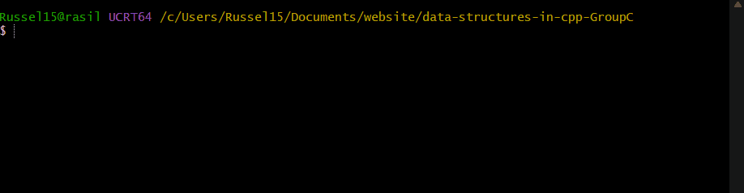

<div align="center">


# Data Structures in C++

**A handcrafted open-source library of fundamental data structures — built from scratch and learned from class, benchmarked at scale, and twisted for fun. This project is made as a requirement for CMSC 123: Data Structures and Algorithms | BS Computer Science, UP Cebu**

[](https://www.gnu.org/licenses/gpl-3.0)
[](https://isocpp.org/)
[]()
[]()

</div>

---

## Table of Contents

1. [➤ About](#about)
2. [➤ Data Structures](#data-structures)
3. [➤ Project Structure](#project-structure)
4. [➤ Getting Started](#getting-started)
5. [➤ How to Build](#how-to-build)
6. [➤ Running Benchmarks](#running-benchmarks)
7. [➤ Benchmark Results](#benchmark-results)
8. [➤ Fundamental Twists](#the-twists)
9. [➤ References](#references)
10. [➤ License](#license)
11. [➤ Authors](#authors)

---

## About

This is a small open-source library of fundamental Abstract Data Types (ADTs) implemented in C++17, written as a course project for **CMSC 123: Data Structures and Algorithms**.

Every implementation is written **from scratch** with the aid of discussion notes from class — no direct copy-pasting from textbooks or external sources. Each data structure also includes a **creative twist**: a non-standard feature that either improves real-world performance, adds safety, or reveals something empirically interesting about the structure's behavior.

The library is benchmarked at scales from **1,000 to 10,000,000 elements** to demonstrate real-world performance characteristics beyond Big-O notation.

---

## Data Structures

| ADT | Implementation | File | Features | Author |
|-----|---------------|------|-------|--------|
| **FILO Queue** | Array Stack | `src/arraystack.h` | Data Shredding, Safety Netting, Growth Tracking | Russel Niño Buno |
| **FIFO Queue** | Singly Linked List | `src/sllist.h` | Node Pooling, Self-Healing (Floyd's Cycle Detection) | Russel Niño Buno |
| **Priority Queue** | Meldable Heap | `src/meldableheap.h` | Merge Counter as O(log n) proof | Russel Niño Buno |
| **Deque** | Array Deque | `src/arraydeque.h` | Growth Tracking, Contain | Angelo Mari Manlangit |
| **List** | Array Deque + Doubly Linked List | `src/arraydeque.h`, `src/dllist.h` | Node Pooling, Self-Healing (Floyd's Cycle Detection), Custom Traversal System | Angelo Mari Manlangit |
| **Sorted Set** | Skiplist + Red-Black Tree | `src/skiplist.h`, `src/redblacktrees.h` | Search Iteration Count, Leaf Display (for Red-Black Trees) | Angelo Mari Manlangit |
| **Unsorted Set** | Chained Hash Table | `src/chainedhashtable.h` | *TO ADD* | Gian Jefferson Reyes |
| **Graph** | Adjacency Matrix | `src/AdjacencyMatrix.h` | Weighted Edges, Degree Calculation | Gian Jefferson Reyes |

---

## Project Structure

```
data-structures-in-cpp-GroupC/
│
├── include/                  # Abstract interfaces (ADTs)
│   ├── array.h               # Generic resizable array wrapper
│   ├── deque.h               # Deque struct
│   ├── list.h                # List ADT interface
│   ├── node.h                # Singly & Doubly linked node structs
│   ├── queue.h               # Queue ADT interface
│   └── sset.h                # Sorted Set ADT interface
│
├── src/                      # Concrete implementations
│   ├── arraystack.h          # FILO Stack (array-based)
│   ├── sllist.h              # FIFO Queue (singly linked list)
│   ├── meldableheap.h        # Priority Queue (randomized meldable heap)
│   ├── arraydeque.h          # Deque (array-based)
│   ├── dllist.h              # Doubly Linked List
│   ├── skiplist.h            # Sorted Set (skiplist)
│   ├── redblacktrees.h       # Sorted Set (red-black tree)
│   ├── chainedhashtable.h    # Unsorted Set (hash table)
│   └── adjacencymatrix.h     # Graph (adjacency matrix)
│
├── tests/                    # Benchmarks & test cases
│   ├── arraystack.cpp
│   ├── sllist.cpp
│   ├── meldableheap.cpp
│   ├── arraydeque.cpp
│   ├── dllist.cpp
│   ├── skiplist.cpp
│   ├── redblacktrees.cpp
│   ├── chainedhashtable.cpp
│   └── adjacencymatrix.cpp
│
├── assets/
│   └── demo_build.gif        # Build & run demo recording
│
├── Makefile
├── BENCHMARKS.md
├── LICENSE
└── README.md
```

---

## Getting Started

### Prerequisites

- A C++17-compatible compiler: `g++ 9+` or `clang++ 9+`
- `make` (optional but recommended)
- Works on **Windows (MSYS2/MinGW)**, **Linux**, and **macOS**

### Clone the repository

```bash
git clone https://github.com/your-group/data-structures-in-cpp-GroupC.git
cd data-structures-in-cpp-GroupC
```

---

## How to Build

### Manual Compilation

The general template for compiling any test is:

```bash
g++ -std=c++17 -O2 -Iinclude -Isrc tests/<name>.cpp -o <name>_test
```

> Replace `<name>` with the target — e.g. `arraystack`, `sllist`, `meldableheap`, `arraydeque`, `dllist`, `skiplist`, `redblacktrees`.

> Use `-O2` for optimized benchmark builds. Swap for `-g` when debugging.

Here's what a full build and run looks like:



---

## Running Benchmarks

Each data structure has its own benchmark in `tests/`. Run them after building:

```bash
./arraystack_test
./sllist_test
./meldheap_test
./arraydeque_test
./dllist_test
./skiplist_test
./redblacktrees_test
```

Benchmarks measure:
- **Add / Enqueue / Push** time at multiple scales
- **Remove / Dequeue / Pop** time at multiple scales
- **Twist-specific metrics** (resize count, merge count, search count, pool size, absorb time)

---

## Benchmark Results

Full benchmark results and STL comparisons are documented separately.

➤ **[View Full Benchmark Results →](./BENCHMARKS.md)**

---

## Some Twists

Each data structure was given a non-standard twist beyond the textbook implementation.

### ArrayStack

**1. Data Shredding**
Vacated memory slots are zeroed out with `T()` after every `remove()` and `resize()`. This prevents sensitive data from lingering in memory beyond its lifetime which is a subtle but important security consideration.

**2. Safety Netting**
`get()` and `set()` return a default `T()` value instead of crashing when accessing out-of-bounds indices. Therefore, providing safe access without exceptions.

**3. Growth Tracking**
The stack tracks every internal `resize()` event via a counter accessible through `get_resize_count()`, which lets you observe the amortized growth pattern and verify that resize events are infrequent even at 100M operations.

---

### SLList 

**1. Node Pooling**
Instead of calling `new`/`delete` on every push and pop, freed nodes are stashed in a reuse `vector`. The next push grabs from the pool first before touching the heap. After warmup, the queue runs almost entirely allocation-free — directly addressing the biggest real-world weakness of linked lists.

**2. Self-Healing via Floyd's Cycle Detection**
On every push, the queue checks if `tail->next` is non-null, which would indicate a corrupted cycle. If triggered, Floyd's tortoise-and-hare algorithm finds the cycle entry point and cuts it, restoring the list automatically.

---

### MeldableHeap 

**Merge Counter**
Every call to `merge()` that performs real work (both arguments non-null) increments a counter. After a benchmark run, you can retrieve the total merge count via `get_merge_count()` and compare it to the theoretical O(log n) expectation.

This empirically shows that the average merge depth per operation is ~0.65 × log₂(N) — less than the theoretical ceiling because the randomized coin flip tends to pick shorter paths on average.

---

### Array Deque 

**1. Growth Tracking**
The deque tracks every internal `resize()` event via a counter accessible through `get_resize_count()`. This lets you observe the amortized growth pattern and verify that resize events are infrequent even at 100M operations.

**2. Contains**
`contains()` returns a boolean value depending on whether or not an inputted value is present within the Array Deque. This is helpful in trying to search for certain values that could be somewhere in the middle of the deque.

---

### DLList 

**1. Node Pooling**
Instead of calling `new`/`delete` on every push and pop, freed nodes are stashed in a reuse `vector`. The next push grabs from the pool first before touching the heap. After warmup, the list runs almost entirely allocation-free — directly addressing the biggest real-world weakness of linked lists.

**2. Self-Healing via Floyd's Cycle Detection**
On every push, the list checks if `tail->next` is non-null, which would indicate a corrupted cycle. If triggered, Floyd's tortoise-and-hare algorithm finds the cycle entry point and cuts it, restoring the list automatically.

**3. Custom Traversal System**
A current node pointer is available to traverse the doubly linked list. Move forward and backward using `moveNextNode()` and `movePreviousNode()`. Additionally, insert new values relative to the current position with `insertAfterNode()` and `insertBeforeNode()`.

---

### Skiplist 

**Search Iteration Count**
The number of iterations and moves it takes until the inputted value is found is recorded. Use `find()` then `currentFindCount()` to retrieve it. This lets you observe the practical complexity of searching a value in a sorted skiplist.

---

### Red-Black Trees 

**1. Search Iteration Count**
The number of iterations and moves it takes until the inputted value is found is recorded. Use `find()` then `currentFindCount()` to retrieve it. This lets you observe the practical complexity of searching a value in a sorted red-black tree.

**2. Display Leaves**
`displayLeaves()` prints all nodes of the Red-Black Tree with their corresponding colors in order. This is useful for verifying structural integrity — checking that no node violates the rules and conditions of a valid Red-Black Tree.

---

### Graph: Adjacency Matrix

**1. Weighted Edges**
The values in `edge[i][j]` include the weight of the edge, with `std::numeric_limits<double>::infinity()` representing the absence of edge.

**2. Degree Calculation**
There are methods to get the degree (count of edges) entering (`inDegreeOf()`) and leaving (`outDegreeOf()`) a vertex.

---

## References

- Morin, P. *Open Data Structures (C++ Edition)*. [opendatastructures.org](https://opendatastructures.org)
  - §3 — Linked Lists
  - §10.2 — Randomized Meldable Heap
- Knuth, D.E. *The Art of Computer Programming, Vol. 2: Seminumerical Algorithms*. Addison-Wesley, 1969. §3.1 — Floyd's Cycle Detection

---

## License

This project is licensed under the **GNU General Public License v3.0**.

See [`LICENSE`](./LICENSE) for the full license text.

> This license ensures the library remains free and open — any derivative work must also be open source under the same terms.

---

## Authors

**Group C**

| Name | Implementations |
|------|----------------|
| Russel Niño Buno | ArrayStack, SLList, MeldableHeap, README |
| Angelo Mari Manlangit | ArrayDeque, DLList, Skiplist, Red-Black Tree |
| Gian Jefferson Reyes | ChainedHashTable, AdjacencyMatrix |

---

<div align="center">

Made with ☕ and too many benchmark runs. This open-source project is part of a requirement in CMSC 123: Data Structures and Algorithms.

[](https://raw.githubusercontent.com/andreasbm/readme/master/assets/lines/rainbow.png)

*Data Structures in C++ — Group C*

</div>
